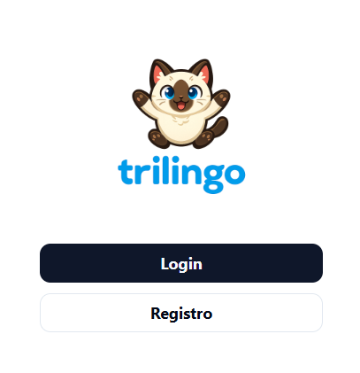
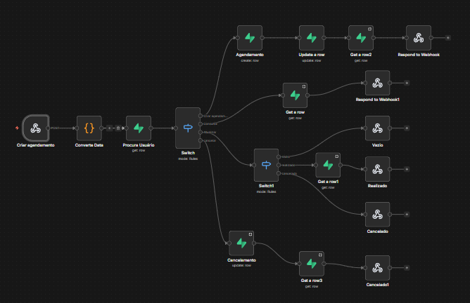
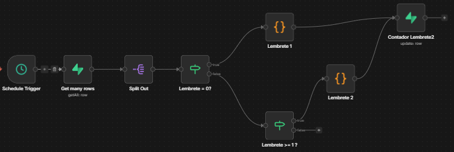

# 🤖 Chatbot com Agendamento, Bloqueio e Lembretes — N8N + React + Supabase

Este projeto implementa um chatbot utilizando o **N8N como backend de automação**, integrado a um frontend em **React**, com persistência de dados no **Supabase (PostgreSQL)**.

O bot é capaz de:

- Interagir dinamicamente com usuários via LLM  
- Agendar conversas  
- Bloquear e desbloquear contatos  
- Enviar lembretes automáticos após inatividade  
- Respeitar regras de comunicação e prevenção de spam  

Projeto desenvolvido como **Desafio Técnico de Backend/Automação**.

---

## 🚀 Stack Utilizada

### Backend
- [N8N](https://n8n.io/) — Orquestração de fluxos e automação
- Railway para hospedagem dos fluxos do n8n
- Webhooks para comunicação com frontend
- Integração com LLM (OpenAI)

### Frontend
- React (Vite)

### Banco de Dados
- Supabase (PostgreSQL)

## 🤖 Acesso ao Bot

]

URL -> https://apptrilingo.netlify.app/

## 💻 Como utilizar

Primeiro é necessário se registrar ou fazer login.
O chat conta com sistema de autenticação do supabase para cumprir com uma regra do desafio de e-mail único.

### 1️⃣ Sistema de Bloqueio/Desbloqueio

O usuário pode ser bloqueado usando o postman (ou similar) com endpoint:
```
POST
https://n8n-production-dabf.up.railway.app/webhook/bloqueio
Body:
{
  "email": "email_do_usuario@email.com",
  "bloqueado": "true"
}
```
Também pode ser desbloqueado através de um botão na tela ou usando o postman:
```
POST
https://n8n-production-dabf.up.railway.app/webhook/desbloqueio
Body:
{
  "email": "email_do_usuario@email.com",
  "bloqueado": "true"
}
```
### 2️⃣ Sistema de Agendamento

O chat conta com 4 botões na tela que acionam o fluxo do n8n para agendamentos:

Fluxo -> https://n8n-production-dabf.up.railway.app/webhook/api/v1/agendamento

No fluxo é possível:

- Agendar Conversa
- Consultar uma data agendada
- Atualizar (trocar) a data escolhida
- Cancelar Agendamento




O webhook recebe os dados do usuário logado no frontend e também a data escolhida para agendamento.
Em seguida converte a data para ISO 8601 que é o padrão aceito pelo Supabase.
No próximo node ele recupera os dados do usuário e filtra a ação que o usuário deseja fazer, direncionando o fluxo pra ela.

### 3️⃣ Sistema de Lembretes



O sistema também possui um sistema de lembretes.
Se o usuário ficar inativo por 15 minutos o sistema envia uma mensagem de inatividade.
Se ele ficar inativo por mais 15 minutos uma segunda mensagem é enviada.
A partir da segunda mensagem nenhuma outra é enviada.
A qualquer momento que o usuário faça uma interação com o chat o sistema é resetado.


